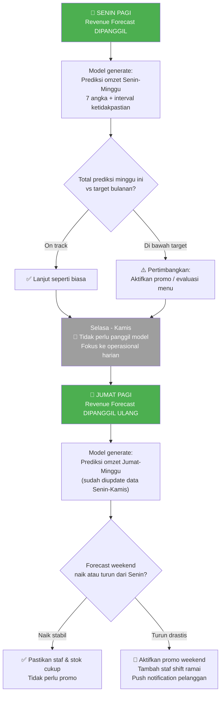
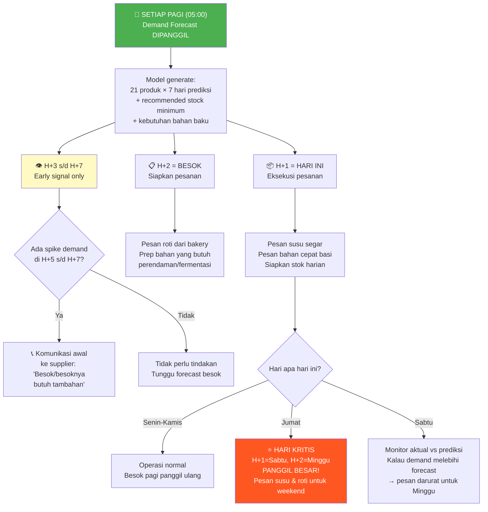
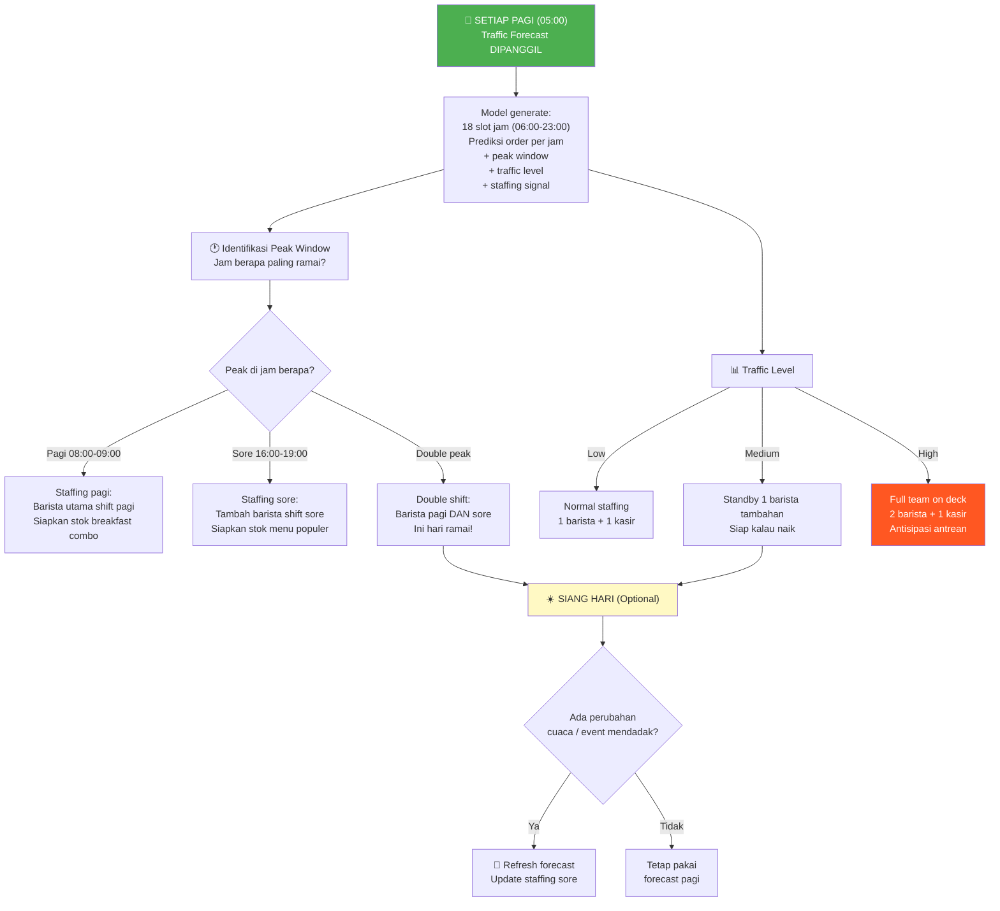
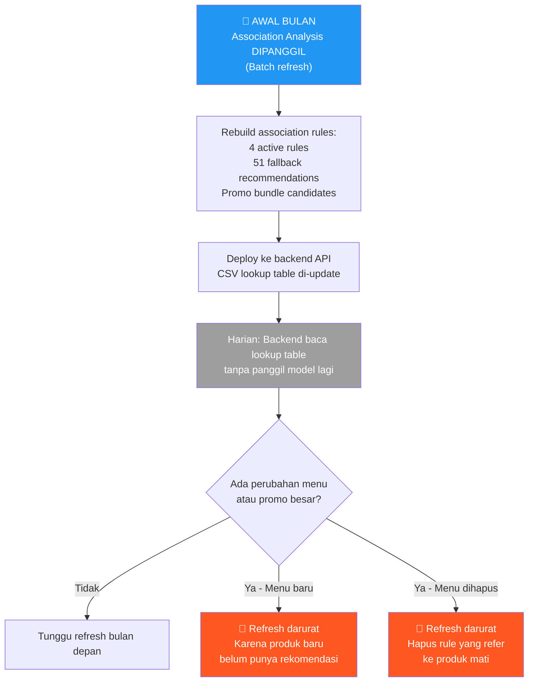
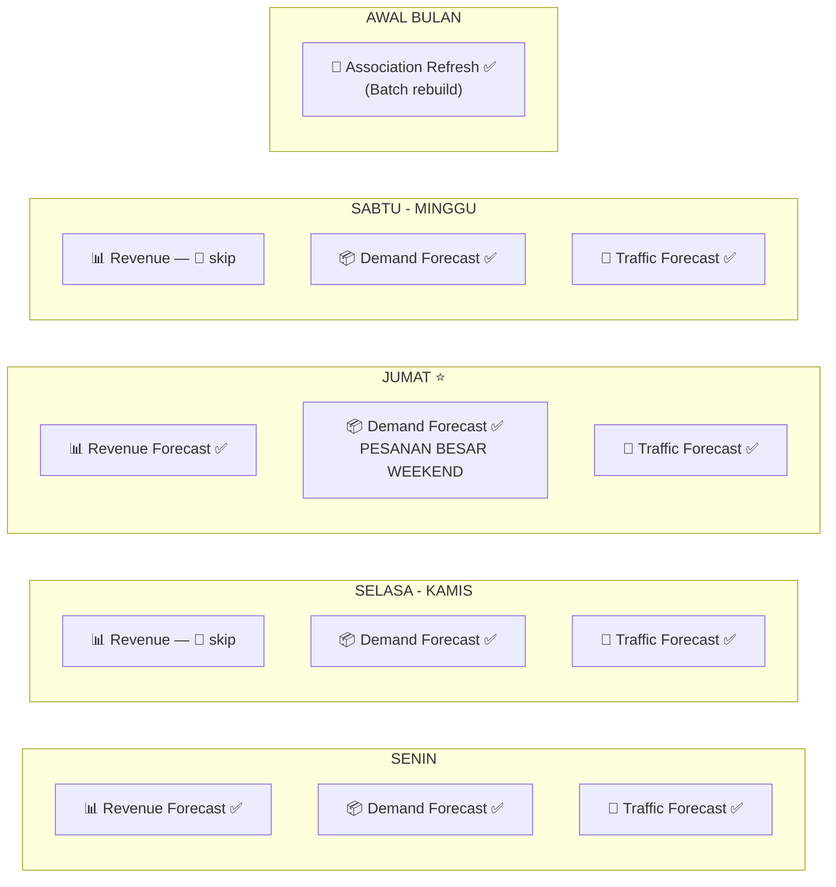

## Keputusan Strategi Inference untuk Seluruh Model

Berdasarkan karakter output, use case bisnis, dan siklus operasional kedai, ini strategi terbaik untuk **masing-masing** dari 4 model kamu.

---

## Model 03 — Revenue Forecast H+7

### Keputusan: **2x seminggu (Senin + Jumat)**

### Alasan

1. **Revenue itu metrik agregat — 1 angka per hari** — Berbeda dengan demand yang 21 produk × 7 hari, revenue forecast cuma menghasilkan 7 angka prediksi. Perubahannya dari hari ke hari tidak drastis karena pola mingguan kedai sangat konsisten.

2. **Keputusan berbasis revenue bersifat strategis, bukan taktis** — Kamu tidak ubah target omzet tiap hari. Kamu set di awal minggu, lalu cek ulang sebelum weekend. Dua momen ini (Senin = planning, Jumat = pre-weekend check) yang paling kritis.

3. **WMAPE 13.19% cukup stabil** — Bahkan forecast yang dibuat Senin untuk Jumat masih reasonable. Tidak perlu di-update tiap hari karena improvement-nya marginal.

### Flowchart

### Kapan Outputnya Dipakai

| Momen      | Output yang Dipakai     | Keputusan Bisnis                                                 |
| ---------- | ----------------------- | ---------------------------------------------------------------- |
| Senin pagi | Total prediksi 7 hari   | Set target mingguan, planning cashflow                           |
| Senin pagi | Prediksi per hari       | Kalau ada hari yang sangat rendah → timing promo                 |
| Jumat pagi | Prediksi Jumat-Minggu   | Final check: cukup stok? Perlu promo?                            |
| Jumat pagi | Interval ketidakpastian | Kalau interval lebar → ada ketidakpastian besar → siapkan plan B |

---

## Model 04 — Product Demand Forecast H+7

### Keputusan: **Setiap hari (7x seminggu) — WAJIB**

### Alasan

1. **Langsung menentukan berapa bahan baku yang dipesan** — Ini bukan angka yang cuma "dilihat", ini angka yang langsung dieksekusi jadi pesanan ke supplier. Pesanan salah = stockout atau waste.

2. **Bahan baku cepat basi butuh keputusan harian** — Susu (3-5 hari), Croissant (1-2 hari). Tidak bisa pesan 7 hari sekali.

3. **21 produk × 7 hari = 147 prediksi yang bisa berubah** — Setiap hari ada data baru masuk, demand per produk lebih volatile daripada total revenue. WMAPE 21.34% artinya perlu update terus supaya akurasinya terjaga.

4. **Outputnya sudah berupa action layer** — Model ini tidak cuma prediksi, tapi juga menghasilkan `recommended_stock_minimum` dan `demand_ingredient_requirements`. Artinya outputnya langsung bisa dieksekusi jadi pesanan.

### ⚠️ PENTING: Cara Baca Output-nya

**JANGAN** pesan bahan baku untuk 7 hari sekaligus berdasarkan satu forecast. Gunakan strategi **rolling window**:

| Horizon         | Peran       | Tindakan                                                                                  |
| --------------- | ----------- | ----------------------------------------------------------------------------------------- |
| **H+1**         | ✅ EKSEKUSI | Pesan bahan cepat basi (susu, roti) untuk **hari ini**                                    |
| **H+2**         | ✅ SIAP     | Pesan bahan yang butuh prep 1 hari (roti dari bakery)                                     |
| **H+3 s/d H+7** | 👁️ PANTAU   | Early signal — kalau naik tajam, komunikasi awal ke supplier. **TAPI jangan pesan dulu.** |

### Flowchart

### Output yang Dipakai Per Hari

| File Output                                      | Kapan Dipakai | Untuk Apa                                |
| ------------------------------------------------ | ------------- | ---------------------------------------- |
| `demand_next_7_days.csv`                         | Setiap pagi   | Cek H+1 untuk pesanan hari ini           |
| `demand_ingredient_requirements_next_7_days.csv` | Setiap pagi   | Konversi demand → kebutuhan bahan baku   |
| `demand_top_products_next_7_days.csv`            | Jumat pagi    | Fokus stok untuk top products di weekend |

---

## Model 05 — Hourly Traffic Forecast H+18

### Keputusan: **Setiap awal hari operasional (1x/hari) + Optional mid-day refresh**

### Alasan

1. **Horizon cuma 18 jam (1 hari operasional)** — Artinya setiap pagi kamu butuh prediksi baru karena prediksi kemarin sudah expired. Tidak bisa di-skip.

2. **Penggunaan utama: staffing & shift planning** — Kamu butuh tahu jam berapa puncaknya hari ini buat ngatur barista. Ini keputusan yang harus diambil **sebelum buka**.

3. **Tidak perlu lebih sering dari 1x/hari** — Karena cuaca dan promo biasanya tidak berubah di tengah hari. Tapi kalau ada event mendadak (misal hujan deras), bisa di-refresh siang.

4. **Berbeda dari model H+7** — Traffic model ini tidak ada overlap antar hari. Setiap forecast hanya berlaku untuk 1 hari. Jadi jelas **harus dipanggil tiap pagi**.

### Flowchart

### Output yang Dipakai

| Output                          | Keputusan Bisnis                                        |
| ------------------------------- | ------------------------------------------------------- |
| Prediksi per jam                | Jumlah barista per shift                                |
| Peak window (jam teramai)       | Waktu istirahat staf diatur di luar peak                |
| Traffic level (low/medium/high) | Siapkan take-away cup, stok additional                  |
| Staffing signal                 | Direct decision: perlu panggil staf tambahan atau tidak |

---

## Model 06 — Product Association

### Keputusan: **1x per bulan (batch refresh)**

### Alasan

1. **Ini BUKAN model forecasting** — Tidak ada prediksi masa depan. Ini lookup table berbasis aturan asosiasi (rule-based). Cukup dibangun ulang secara periodik.

2. **Pola belanja pelanggan berubah lambat** — Hubungan "Roti Bakar Coklat + Cafe Latte Hot" tidak berubah dari minggu ke minggu. Butuh bulanan agar ada cukup data baru yang bisa menggeser pola.

3. **Dipakai di checkout/rekomendasi — real-time tapi datanya statis** — Backend cuma baca CSV lookup, tidak perlu panggil model setiap kali. Artinya biaya computasinya nyaris nol di runtime.

4. **Dari kodemu sendiri** — Metadata association merekomendasikan: `"recommended_production_refresh": "weekly or monthly batch refresh"`.

### Kapan perlu refresh lebih cepat?

| Trigger                      | Aksi                                                       |
| ---------------------------- | ---------------------------------------------------------- |
| Menu baru ditambahkan        | Refresh association (karena produk baru belum punya rule)  |
| Menu dihapus/dinonaktifkan   | Refresh association (hapus rule yang refer ke produk mati) |
| Promo bundling besar selesai | Refresh setelah 2 minggu data baru masuk                   |
| Tidak ada perubahan menu     | Refresh rutin tiap bulan                                   |

### Flowchart

### Output yang Dipakai

| File Output                      | Kapan Dipakai               | Untuk Apa                                                         |
| -------------------------------- | --------------------------- | ----------------------------------------------------------------- |
| `cross_sell_recommendations.csv` | Real-time di checkout       | "Beli Roti Bakar Coklat? Tambah Cafe Latte Hot diskon 15%"        |
| `fallback_recommendations.csv`   | Real-time di product detail | Produk tanpa rule → rekomendasikan produk populer lintas kategori |
| `promo_bundle_candidates.csv`    | Saat planning promo bulanan | "Bundle Sarapan: Roti Bakar + Kopi, bundling Tea-Time, dll"       |

---

## Ringkasan: Semua Model dalam Satu Minggu

### Tabel Keputusan Final

| Model                 | Frekuensi     | Hari Wajib   | Biaya/bulan   | Alasan Utama                                     |
| --------------------- | ------------- | ------------ | ------------- | ------------------------------------------------ |
| **03 - Revenue H+7**  | **2x/minggu** | Senin, Jumat | ~8 inference  | Keputusan strategis, tidak berubah tiap hari     |
| **04 - Demand H+7**   | **7x/minggu** | Setiap hari  | ~30 inference | Langsung menentukan pesanan bahan baku           |
| **05 - Traffic H+18** | **7x/minggu** | Setiap hari  | ~30 inference | Staffing harian, expired setiap 18 jam           |
| **06 - Association**  | **1x/bulan**  | Awal bulan   | 1 batch       | Lookup table statis, pola belanja berubah lambat |

### Total pemanggilan model per bulan: ~69 inference + 1 batch refresh

Ini sangat efisien. Model XGBoost yang kamu pakai bisa inferensi dalam hitungan detik per panggilan, jadi total beban komputasi per bulan kurang dari **5 menit**.
